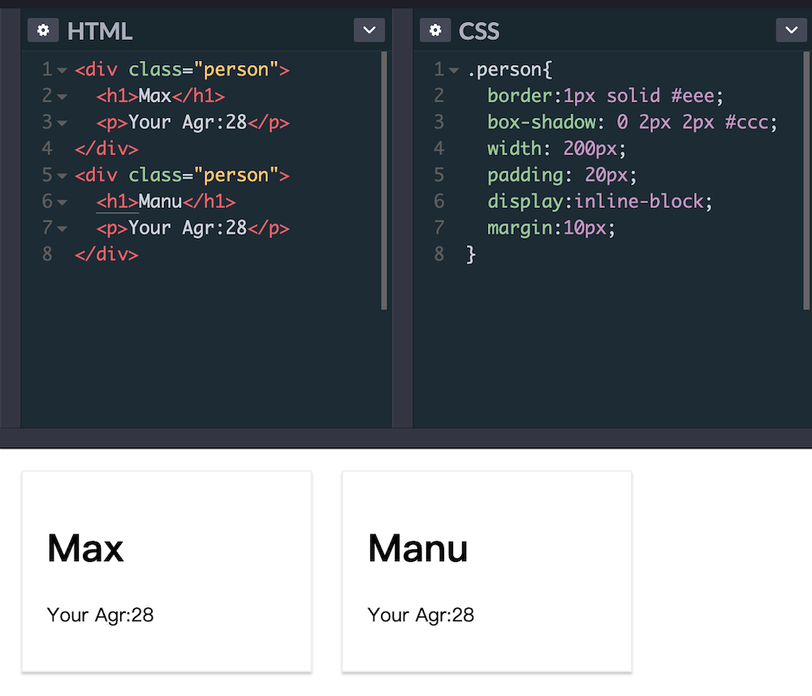
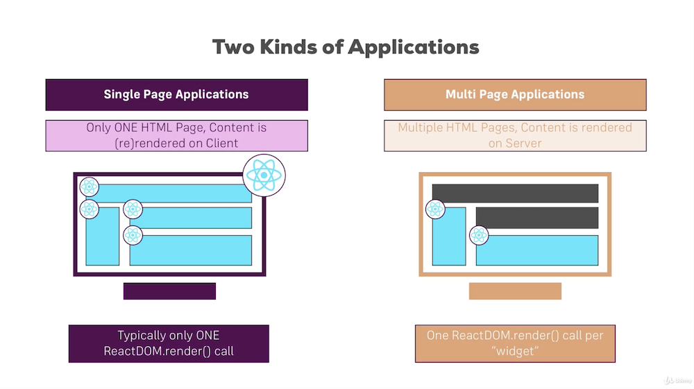

#Section 1: Geting Started
<a href="https://reactjs.org/" target="_blank">React Home page</a>  
React: A Javascript Library for builging User Interfaces  
React components can be thought of custom HTML elements  
A react component is a function

#### Pure HTML& CSS VS React
`ReactDOM.render()` allows us to render a JS function as a component to the real DOM. Default is rendered as block element

#### Why React?

-  UI state becomes difficult to handle with Vanilla JavaScript
-  Focus on Business Logic, not on preventing your App from exploding
-  Huge Ecosystem, Active Commuity, High Performance

#### Course Outline

-  The Basics
-  Debugging
-  Styling Components
-  Components Deep Dive
-  HTTP Requests
-  Routing
-  Forms & Validation
-  Redux
-  Authentication
-  Testing Introduction
-  Deployment
-  Bonus(Animations, Next JS, Webpack)