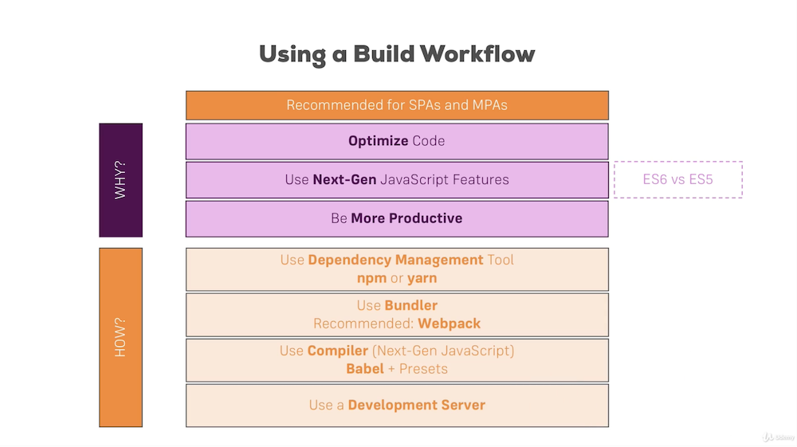

#Section3: Understanding the Base Features & Syntax



<a href="https://github.com/facebook/create-react-app" target="__blank">Create React apps with no build configuration: Create React App</a>

<span style="color: red; font-size: 17px">Every React Component has to return or render some HTML code which can be rendered to the screen!</span>

#### Understanding JSX
write "HTML" code inside Javascript  
Restrictions: 

- since class is a keyword reserved by JS, we use className
- when we return, we need all to be in one root element (typically)

```JSX
class App extends Component{
  render(){
    return(
     <div className="App">
       <h1>Hi, I'm a React App</h1>
     </div> 

     /*
      The return parts will be translate into
      React.createElement('div', {className:'App'}, React.createElement('h1', null, 'Hi, I'm a React App'));
     */
    );
  };
};
```

#### React Components
A conponent is just a function return JSX
```JSX
import React from 'react';
const person = () => {
    return <p>I'm a Person!</p>
};
```
Daynamic content, the function can take in an argument which will contains all the properties we write at the JSX code. If we use the class-based components, it's in `this.props`  
To output the content between the opening and closing tage of our custom HTML tage, there is a special `prop` React provided -- `props.children`  

App.js
```JSX
import React, {Component} from 'react';
import './App.css';
import Person from './Person/Person';

class App extends Component{
  render(){
    return(
     <div className="App">
       <h1>Hi, I'm a React App</h1>
       <Person name="ziping" age="23"/>
       <Person name="Fangyuan" age="25"> I love Food</Person>
       <Person name="HJ" age="24"/>
     </div> 
    );
  };
};
```

Persons.js
```JSX
import React from 'react';

const person = (props) => {
    return (
        <div>
            <p>I'm a {props.name} and {props.age} years old!</p>
            <p>{props.children}</p>
        </div>
    );
};

export default person;
```
***
##### Class-based component: state
There is a special property called `state` which is an object, for every class-based components that extends from `Component`. If the state change, React will rerender the object.

<a href="https://reactjs.org/docs/events.html#supported-events" target="__blank">List of event that can be listened by React</a>  
Using the `setState` method to change the `state`, which takes in an object and it will merge this object to the `state`.
```JSX
class App extends Component{
  state = {
    persons: [
      {name:'ziping', age:23},
      {name:'fangyuan', age:25},
      {name:'HJ', age:24}
    ]
  };

  switchNameHandler = () => {
    // DONT DO THIS: this.state.persons[0].name = "ziping Liu"
    this.setState({
      persons: [
        {name:'ziping Liu', age:23},
        {name:'fangyuan', age:25},
        {name:'HJ', age:25}
      ]
    })
  };

  render(){
    return(
     <div className="App">
       <h1>Hi, I'm a React App</h1>
       <button onClick={this.switchNameHandler}>Switch name</button>
       <Person name={this.state.persons[0].name} age={this.state.persons[0].age}/>
       <Person name={this.state.persons[1].name} age={this.state.persons[1].age}> I love Food</Person>
       <Person name={this.state.persons[2].name} age={this.state.persons[2].age}/>
     </div> 
    );
  };
};
```
***
#####functional-based components: hooks
`useState` is the most important react hooks, allow us to manage state from a functional component. Takes in an object and returns an arry with exactly 2 elements. The 1st element will be the current state, 2nd element is a function that allows us to update the state.<span style="color: red">(!This one does not merge the two state objects. it replaces the old one.)</span>
```JSX
import React, {useState} from 'react';
import './App.css';
import Person from './Person/Person';


const App = props => {
  const [personsState, setPersonsState] = useState({
    persons: [
      {name:'ziping', age:23},
      {name:'fangyuan', age:25},
      {name:'HJ', age:24}
    ]
  });

  const switchNameHandler = () => {
    setPersonsState({
      persons: [
        {name:'ziping Liu', age:23},
        {name:'fangyuan', age:25},
        {name:'HJ', age:25}
      ]
    })
  };

  return(
    <div className="App">
      <h1>Hi, I'm a React App</h1>
      <button onClick={switchNameHandler}>Switch name</button>
      <Person name={personsState.persons[0].name} age={personsState.persons[0].age}/>
      <Person name={personsState.persons[1].name} age={personsState.persons[1].age}> I love Food</Person>
      <Person name={personsState.persons[2].name} age={personsState.persons[2].age}/>
    </div> 
    );
};
```
***
####Stateless vs Stateful Components
Stateless(dumb, presentational): no state management  
Stateful(smart, cotainer): manage state
***

####Passing Method References between Components
we can set a new property which cantains the reference of method, and the other components can access it by using the `props`. In the case we also want to handle arguments to the method, we need to use `bind`  

App.js
```JSX
class App extends Component{
  state = {
    persons: [
      {name:'ziping', age:23},
      {name:'fangyuan', age:25},
      {name:'HJ', age:24}
    ]
  };

  switchNameHandler = (newName) => {
    // DONT DO THIS: this.state.persons[0].name = "ziping Liu"
    this.setState({
      persons: [
        {name:newName, age:23},
        {name:'fangyuan', age:25},
        {name:'HJ', age:25}
      ]
    })
  };

  changeName = (event) => {
    this.setState({
      persons: [
        {name:'ziping', age:23},
        {name:'fangyuan', age:25},
        {name:event.target.value, age:25}
      ]
    })
  };


  render(){
    return(
     <div className="App">
       <h1>Hi, I'm a React App</h1>
       <button onClick={this.switchNameHandler.bind(this, 'ziping liu')}>Switch name</button>
       <Person 
       name={this.state.persons[0].name} 
       age={this.state.persons[0].age}/>
       
       <Person 
       name={this.state.persons[1].name} 
       age={this.state.persons[1].age}
       click={this.switchNameHandler.bind(this, 'ZIPING LIU')}> I love Food</Person>
       
       <Person 
       name={this.state.persons[2].name} 
       age={this.state.persons[2].age}
       change={this.changeName}/>
     </div> 
    );
  };
};
```
Persons.js
```JSX
const person = (props) => {
    return (
        <div>
            <p onClick={props.click}>I'm a {props.name} and {props.age} years old!</p>
            <p>{props.children}</p>
            <input type="text" onChange={props.change}></input>
        </div>
    );
};
```
***
#### Styling

- external
    + Notice: since we are using webpack. every CSS code we write is Global.
    + Remember to import and css file need the `.css` extension
- inline
    + the style scope will be restricted
    + but the CSS functionality will be limited(later we will learn how to go around this)
    ```JSX

    render(){

        const style = {
          backgroundColor:'white',
          font:'inherit',
          border: '1px solid blue',
          padding: '8px',
          cursor: 'pointer'
        };

        return(
         <div className="App">
           <button 
           style = {style}
           onClick={this.switchNameHandler.bind(this, 'ziping liu')}>
           Switch name</button>
           
           <Person 
           name={this.state.persons[0].name} 
           age={this.state.persons[0].age}/>
         </div> 
        );
      };
    ```
 

