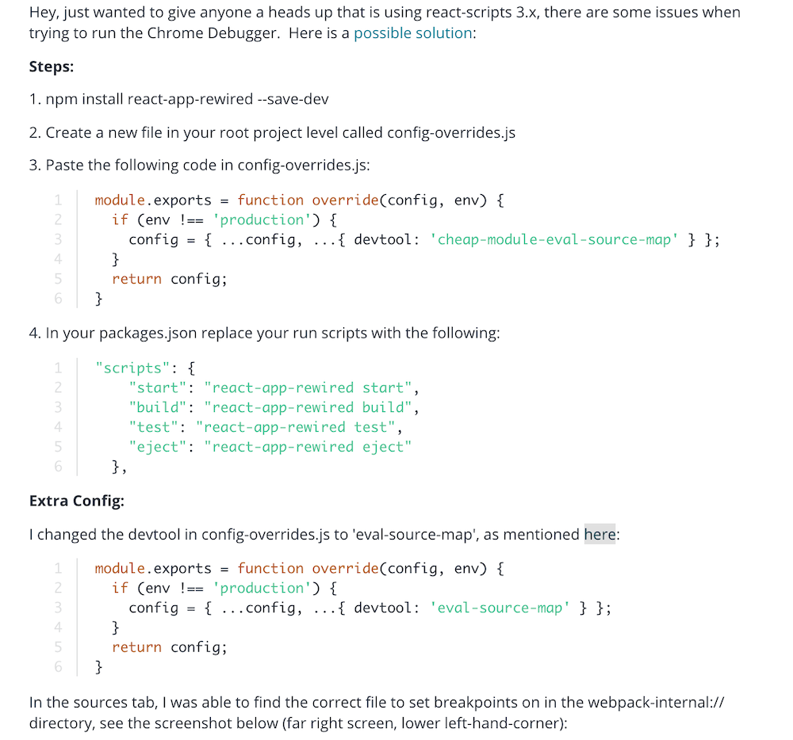

# Section6: Debugging React Apps

Chrom developer tool



React developer tool: an extension of chrom

## Error Boundary

in Javascript: `throw new Error('error message')` to have error message when something went wrong and let the program crash. In react 16+, a new way to handle these error is called Error Boundary.  
We create a new Component:  
the `componentDidCatch` method takes arguments automatically passed by react and will be executed whenever a component we wrap with the ErrorBoundary throws an error  
This will not work in development mode, only in production.

```JSX
import React, {Component} from 'react'

class ErrorBoundary extends Component {
    state = {
        hasError: false,
        errorMessage: ''
    }

    componentDidCatch = (error, info) => {
        this.setState({hasError:true, errorMessage:error});
    }

    render() {
        if(this.state.hasError){
            return <h1>{this.state.errorMessage}</h1>;
        }else{
            return this.props.children;
        }
    }
}
export default ErrorBoundary;
```

---

useful links:  
Error Boundaries: <https://reactjs.org/docs/error-boundaries.html>  
Chrome Devtool Debugging: <https://developers.google.com/web/tools/chrome-devtools/javascript/>
