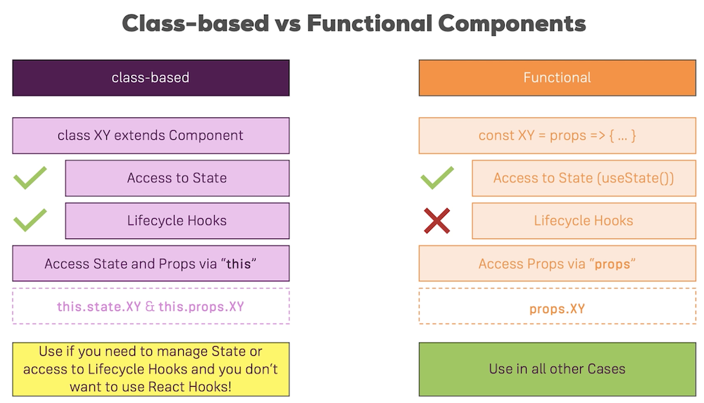
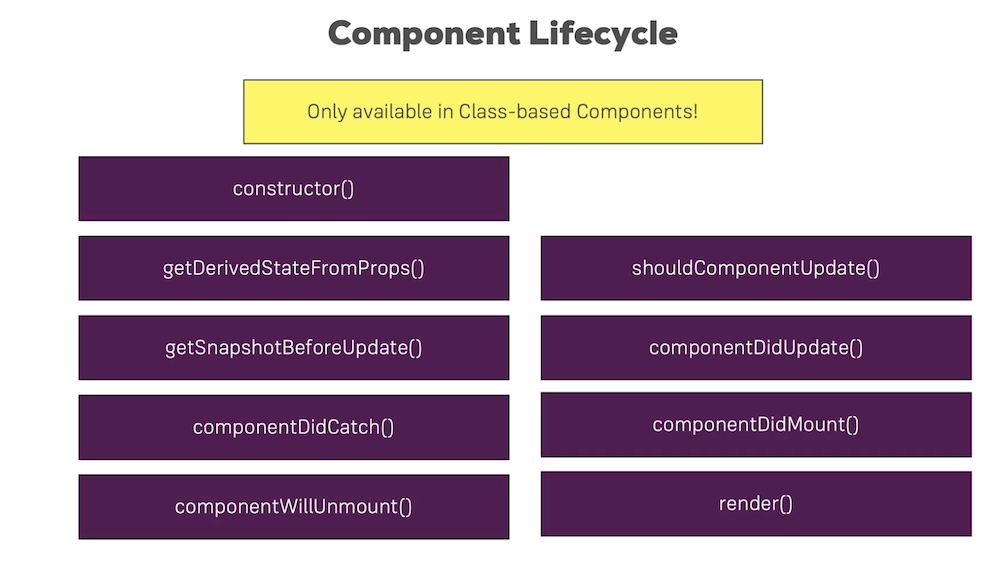
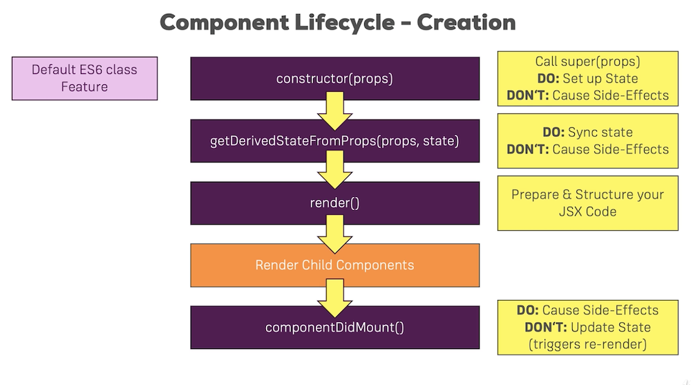
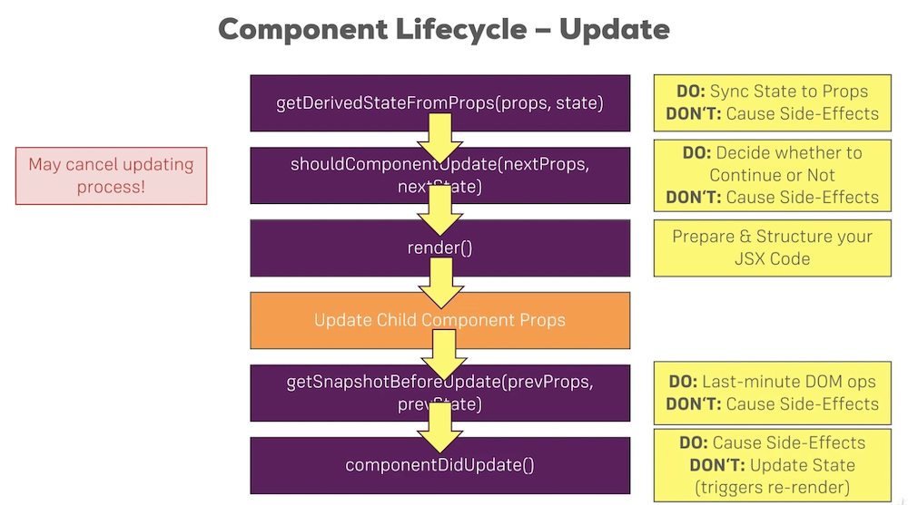
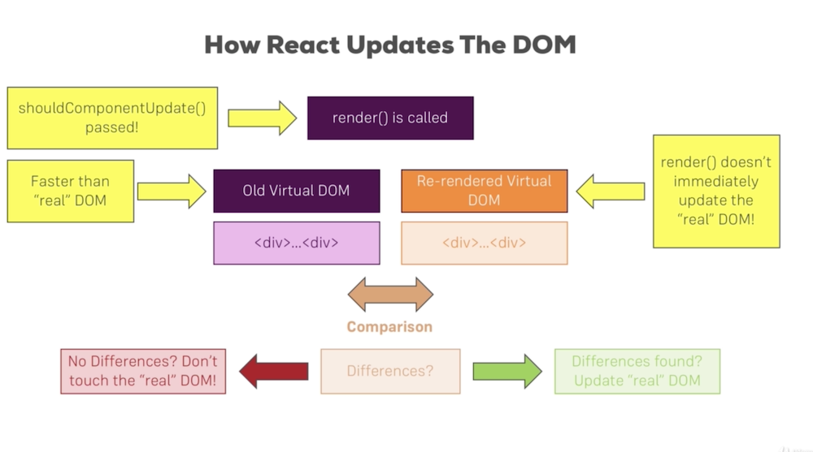

# Section7: Diving Deeper into Components & React Internals

In react 16+, we do not need to warp a list of component under a root element.  
Restructure code: see github history(04/02/2020--Restructure code) on the difference.


#### Class-based Components Lifecycle
<span style="color:red">Lifecycle Hooks has nothing to do with React Hooks</span>  

***
##### Creation Lifecycle


##### Update Lifecycle
props or state change  

`shouldComponentUpdat` can be used for Optimization  
`getSnapshotBeforeUpdate` can perform last-minut DOM ops(ie:record user scorlling position befor re-render and reset the position after that). This method can return an object and this object will be passed to `componentDidUpdate`

##### cleanup work
`componentWillUnmount()` will be called everytime the component will be removed from the DOM.

#### functional-based components Lifecycle equivalent
`useEffect` another important React Hook other than `useState`, it combines all the functionality of the class-based lifecycle hooks into one React Hook.  
`useEffect` by default takes in a function that will run in every render cycle.  
How to control when `useEffect` to execute (ie: not every render, maybe just the first one). We can add a second argument to `useEffect` which is an array of all the variables used in the function. It will execute only when the variables change(Also the first render). If we pass an empty array, it will only run once.  
<span style="font-style: italic;color: blue">Cleanup work in useEffect:</span>  
we can return a function in the function that useEffect takes in, it will run before the main useEffect function runs, but after the (first) render cycle.   
(我的理解:除了第一次useEffect不执行以外，在每次useEffect之前执行)

***
#### Using shouldComponentUpdate for Optimization
we can check if the component use a newer version of information, if it use, then we can reture true, otherwise reture false.  
One more thing about class based components, if we want to implement shouldComponentUpdate where we need to check all the props and states, then we can simply let the component  extendents `PureComponent` instead of `Component`. `PureComponent` class have already implement such functionality.  
<span style="font-style: italic;color: blue">What about in functional component?</span>  
we use `React.memo()` to wrap this component. it will automatically compaire  the input for us and determaine it need update or not.

***
#### How React Update the DOM


***
#### Render Adjacent JSX element
Recall that for each component we must return a single root element. The idea is that we can only returen only 1 expression. We can not return adjacent element. One way to get around with this, is to wrap elements into an array. Another way is to define a higher order component which does dothing but only return it's child. and we can use this element to wrap our elements.  
Since React 16.2+, there is a build in one, `React.Fragment`

***
#### Higher Order Component (HOC)
A HOC is simply an wraper for other component which can add more functionality to the component below: could be styling, some HTML code or JS logic  
```JSX
import React from 'react';

const withCssClass = props => {
return <div className={props.cssClass}>{props.children}</div>
};

export default withCssClass;
```
Another way to write HOC is: instead of define a component we create a function which takes in the lower order component and other arguments needed. Return a functional component or classed component that returns JSX code which wrap the origional component. Keep in mind, Always use a Component start with Capital Letter, all others use lower case letter to start.
```JSX
import React from 'react';

const withCssClass = (WrappedComponent, className) => {
    return props => (
        <div className={className}>
            <WrappedComponent />
        </div>
    );
};

export default withClass;
```
Using this method we can do the following:
```JSX
import Aux from '../components/hocComponent/Aux';
import withCssClass from './hoc/withCssClass';

// in the App component
render(){

    console.log('[App.js] render')

    let personList = null;
    if (this.state.showPersons){
      personList = (
          <PersonList 
          persons = {this.state.persons}
          click = {this.deletePersonsHandler}
          change = {this.nameChangedHandler}>
          </PersonList>
      );
    };

    return(
     <Aux>
       <button onClick={() => {this.setState({showCockpit:false});}}>Remove Cockpit</button>
       {this.state.showCockpit ?<Cockpit
       title={this.props.title}
       personLen={this.state.persons.length}
       click={this.togglePersonsHandler}
       showPersons={this.state.showPersons}>
       </Cockpit>:null}
       {personList}
     </Aux> 
    );
  };

export default withCssClass(App, classes.App);
```

Passing Unknown Props: If look into closely, we notice there is a problem in the second approach. If we use this method on Our Person Component, we notice all the data we passed into Person Component is not being used. Since In the Wraper, we just use `<WrappedComponent />` we did not give it props. But the wraper's job is to wrap any lower component if it wants to. How do we passing props dynamically depending on what lower component is being warped?  

Here is the solution: First of all, the props are not lost, it is just not being used. So all we need is to pass the props to the WrappedComponent.
```JSX
const withCssClass = (WrappedComponent, className) => {
    return props => (
        <div className={className}>
            // <WrappedComponent props={props}/> will not work
            // react will use all the props create a single property not what we want
            <WrappedComponent {...props} />
        </div>
    );
};
```

***
#### <span style="color: red">Setting State Correctly</span>
Looking back to state, there is one more problem. Actually, the `setState` does not guarantee it will execute immediately. So in the case where we want to change a state which depending on the infomation about previous state. We may encounter unexpected changes.  
`setState` does not only take a JS object, it can also works for functions takes in previousState and current Props.
```
/*
this.setState({persons:newPersons, 
    changeCounter: this.state.changeCounter+1});
*/
// changed to this one, since changeCounter depends on old state
this.setState( (prevState, props) => {
      return {
        persons:newPersons, 
        changeCounter: prevState.changeCounter+1
      };
    });
```

***
#### Using PropTypes
A better way to write props is to define each property's type and name. Hence others can understand.  
`npm install --save prop-types`
Keep close attention to the Naming: import with Capital P, use `Component.propTypes` lower case p, accessing types using Uppercase P
```JSX
import React, {Component} from 'react';
import classes from './Person.module.css';
import Aux from '../../hocComponent/Aux';
import withCssClass from '../../../hoc/withCssClass';
import PropTypes from 'prop-types';

class Person extends Component {
    render() {
        console.log('[Person.js] rendering...');
        return (
            <Aux cssClass={classes.Person}>
                <p onClick={this.props.click}>I'm {this.props.name} and {this.props.age} years old!</p>
                <p>{this.props.children}</p>
                <input type="text" onChange={this.props.change} defaultValue={this.props.name}></input>
            </Aux>
        );
    };
};

Person.propTypes = {
    click: PropTypes.func,
    name: PropTypes.string,
    age: PropTypes.number,
    change: PropTypes.func
};

export default withCssClass(Person, classes.Person);
```

***
#### Using Refs
Think about this case, we want to focus on the last person when we show ther person list. The normal way to do this is to use JS querySelector to find that HTML element and add focus to it. But this happends on the whole DOM. React provide another way to do this, the <span style="color:blue"> Ref </span>
property on every elements.  
Two way to do this:

- function approach (old)
```JSX
class Person extends Component {

    componentDidMount(){
        this.inputElement.focus();
    }

    render() {
        console.log('[Person.js] rendering...');
        return (
            <Aux cssClass={classes.Person}>
                <p onClick={this.props.click}>I'm {this.props.name} and {this.props.age} years old!</p>
                <p>{this.props.children}</p>
                <input type="text" onChange={this.props.change}
                    ref = {(inputEl) => {this.inputElement = inputEl}}
                    defaultValue={this.props.name}>
                </input>
            </Aux>
        );
    };
};
```
- constructor approach (new)
```JSX
class Person extends Component {

    constructor(props){
        super(props);
        this.inputElementRef = React.createRef();
    }

    componentDidMount(){
        this.inputElementRef.current.focus();
    }

    render() {
        console.log('[Person.js] rendering...');
        return (
            <Aux cssClass={classes.Person}>
                <p onClick={this.props.click}>I'm {this.props.name} and {this.props.age} years old!</p>
                <p>{this.props.children}</p>
                <input type="text" onChange={this.props.change}
                    ref = {this.inputElementRef}
                    defaultValue={this.props.name}>
                </input>
            </Aux>
        );
    };
};
```

In functional component, using the useRef Hook. The reason we put the click inside useEffect is that, the click will only being avaliable after each render.
```
import React, { useEffect, useRef } from 'react';
import classes from './Cockpit.module.css';

const Cockpit = (props) => {

  const toggleBtnRef = useRef(null);

  useEffect(()=>{
    console.log('[cockpit.js] useEffect');
    // HTTP request
    // setTimeout(()=>{
    //   alert('saved date to cloud!');
    // }, 1000);
    toggleBtnRef.current.click();
    return () => {
      console.log('[cockpit.js] cleanup work in useEffect');
    }
  }, [props.personLen]);

  useEffect(()=>{
    console.log('[cockpit.js] 2nd useEffect');
    return () =>{
      console.log('[cockpit.js] 2nd cleanup work in useEffect');
    };
  });

  let btnClass = '';
    if(props.showPersons){
        btnClass = classes.Red;
    }
    const assignclasses = [];
    if(props.personLen <= 2){
      assignclasses.push(classes.red);
    }
    if(props.personLen <= 1){
      assignclasses.push(classes.bold);
    }

    return(
        <div className={classes.Cockpit}>
          <h1>{props.title}</h1>
          <p className = {assignclasses.join(' ')}>This is really working</p>
          <button className={btnClass} ref={toggleBtnRef}
          onClick={props.click}>Toggle Persons</button>
        </div>
    );
};

export default React.memo(Cockpit);
```

***
#### Using the Context API
In the case where we want to pass props through multiple layers but the middle layer does nothing but only pass the props. It will be too redendent and makes our component less independent. Hence React provide a way to pass props across multiple layers.  
`authContext = React.createContext()` create a user defined scope context. Where takes in anything, an array, a number or an object etc. which can be accessed through defined scope. We use `AuthContext.Provider` to wrap where we want the context are able to reach. use `AuthContext.Consumer` to retrive, but it does not takes JSX code in between, it takes a function which has context as input and return JSX code.  

authContext.js
```JSX
import React from 'react';

const authContext = React.createContext({
    authenticated:false
});

export default authContext;
```
App.js
```JSX
import AuthContext from '../context/authContext';

// in render return statement
    <Aux>
       <button onClick={() => {this.setState({showCockpit:false});}}>Remove Cockpit</button>
       <AuthContext.Provider value={{authenticated:this.state.authenticated}}>
          {this.state.showCockpit ?
          <Cockpit
          title={this.props.title}
          personLen={this.state.persons.length}
          click={this.togglePersonsHandler}
          showPersons={this.state.showPersons}
          login={this.loginHandler}>
          </Cockpit>:null}
          {personList}
        </AuthContext.Provider>
     </Aux> 

```

Person.js
```JSX
import AuthContext from '../../../context/authContext';

// in render return statement
    <Aux cssClass={classes.Person}>
        <AuthContext.Consumer>
            {(context) => context.authenticated? <p>authenticated</p> :<p> please log in</p>    
        </AuthContext.Consumer>
        <p onClick={this.props.click}>I'm {this.props.name} and {this.props.age} years old!</p>                
        <p>{this.props.children}</p>
        <input type="text" onChange={this.props.change}
            ref = {this.inputElementRef}
            defaultValue={this.props.name}>
        </input>
    </Aux>
```

In react 16.6+, it added another way to use context.  

- class based component:
    + we can access context outside the render. add a special function. `static contextType = AuthContext` by this function, react automatically add a context property to the component. and we dont need `AuthContext.Consumer` anymore
- functional based component:
    + `useContext(AuthContext)` hook, simply `context = useContext(AuthContext)` we are able to retrive context.

***
useful links:  
More on useEffect(): https://reactjs.org/docs/hooks-effect.html  
State & Lifecycle: https://reactjs.org/docs/state-and-lifecycle.html  
PropTypes: https://reactjs.org/docs/typechecking-with-proptypes.html  
Higher Order Components: https://reactjs.org/docs/higher-order-components.html  
Refs: https://reactjs.org/docs/refs-and-the-dom.html
