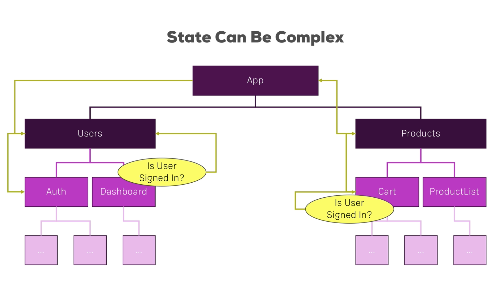
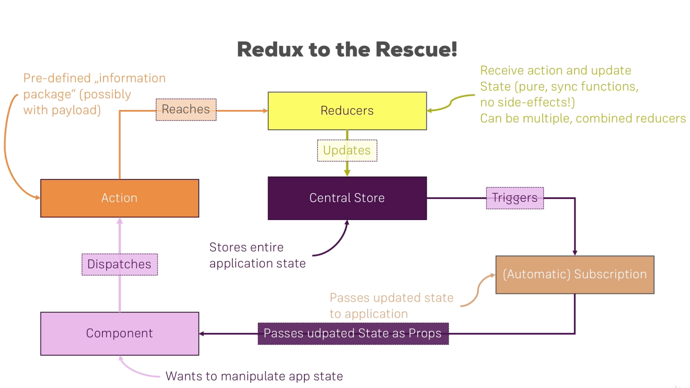
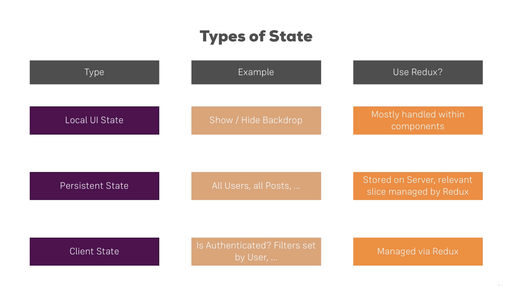

# Section 14: Redux



### How Redux works:


`npm install --save redux`

##### Setup store and root reducer
`redux.createStore` is a function allows us to create a redux stroe. The store must be initialized with a reducer, because the reducer is the only thing that may update the store.  
Reducer is just a function, receive 2 arguments, the first one is the current state, second argument is the action. The function has to return one thing, that is the updated state, a new Javascript object.  
`store.getState()` return the current state in the store

```javascript
// using node to import redux, later we will switch back to React
const redux = require('redux');
const createStore = redux.createStore;

const initialState = {
    counter : 0
}

// Reducer

// here we use the ES6 default value to assing initialState to state whenever the state is undefined
const rootReducer = (state = initialState, action) => {
    return state;
}

// Store
const store = createStore(rootReducer);
console.log(store.getState());
```
##### Dispatching Actions
An action is dispatched by using `store.dispatch()` which takes in an action.  Should be an Javascript object with `type` property. the value should be a unique identifier of our choice. The convention is to use all UPPERCASE LETTER. We can also pass in other property as a payload.
```javascript
const rootReducer = (state = initialState, action) => {
    if(action.type === 'INC_COUNTER'){
        return {
            ... state,
            counter : state.counter + 1
        };
    };
    if(action.type === 'ADD_COUNTER'){
        return {
            ... state,
            counter : state.counter + action.value
        };
    };
    return state;
};

// Dispatching Action
store.dispatch({type: 'INC_COUNTER'});
store.dispatch({type: 'ADD_COUNTER', value: 10});
console.log(store.getState());
```
we then run `node redux-basics.js` will display  
`{ counter: 0 }`  
`{ counter: 11 }`

##### Adding Subscriptions
we dont manually call `store.getState()` we want the state returned to us whenever a state has  changed.  
`store.subscribe()` takes in a function which will be executed whenever the state has changed.
```javascript
// Subscription
store.subscribe(()=>{
    console.log('[Subscription]', store.getState());
});
```
we then run `node redux-basics.js` will display  
```
{ counter: 0 }
[Subscription] { counter: 1 }
[Subscription] { counter: 11 }
{ counter: 11 }
```

### Connecting React to Redux
we normally creat the store in `index.js` file. And for the reducers, since we may have lots of complex reducers in React application, hence we creat a new folder to store these.

using `npm install --save react-redux` to connect react to redux  
we use `createStore` to creat a store, and use `<Provider>` to wrap our application.  
index.js
```JSX
import React from 'react';
import ReactDOM from 'react-dom';
import './index.css';
import App from './App';
import registerServiceWorker from './registerServiceWorker';

import { createStore } from 'redux';
import reducer from './store/reducer';
import {Provider} from 'react-redux';

const store = createStore(reducer);

ReactDOM.render(<Provider store={store}><App /></Provider>, document.getElementById('root'));
registerServiceWorker();
```

reducer.js
```javascript
const initialState = {
    counter: 0
};

const reducer = (state = initialState, action) => {

    switch (action.type) {
        case 'INCREMENT':
            return {
                counter: state.counter + 1
            };
        case 'DECREMENT':
            return {
                counter: state.counter - 1
            };
        case 'ADD':
            return {
                counter: state.counter + action.value
            };
        case 'SUBTRACT':
            return {
                counter: state.counter - action.value
            };
        default:
            return state;
    }
};

export default reducer;
```
***

How do we access the store state from our React Components?  
How to dispatch action from within out Components?  

We need to set up subscription. A little bit different than in node, we will make use of a feature provided by react-redux: `connect` a function which returns a HOC. `connect()` takes in 2 arguments:

1. which parts of the state this component intrested at. A function, which takes in the state stored in redux and returns a javascript object which is a map of prop names and slices of the state stored in redux.
```javascript
const mapStateToProps = state => {
    return{
        ctr: state.counter
    };
};
```
2. which actions will the component dispatch. A function takes in the dispatch function(react-redux will handle this) and return a javascript object where we can define some prop names which will hode a reference to a funcion which should eventually get executed to dispatch an action.
```javascript
const mapDispatchToProps = dispatch => {
    return {
        onIncrementCounter: () => dispatch({type:'INCREMENT'})
    };
};
```
Counter.js
``` JSX
import React, { Component } from 'react';
import {connect} from 'react-redux';

import CounterControl from '../../components/CounterControl/CounterControl';
import CounterOutput from '../../components/CounterOutput/CounterOutput';

class Counter extends Component {

    render () {
        return (
            <div>
                <CounterOutput value={this.props.ctr} />
                <CounterControl label="Increment" clicked={this.props.onIncrementCounter} />
                <CounterControl label="Decrement" clicked={this.props.onDecrementCounter}  />
                <CounterControl label="Add 5" clicked={this.props.onAddCounter}  />
                <CounterControl label="Subtract 5" clicked={this.props.onSubtractCounter}  />
            </div>
        );
    }
}

const mapStateToProps = state => {
    return{
        ctr: state.counter
    };
};

const mapDispatchToProps = dispatch => {
    return {
        onIncrementCounter: () => dispatch({type:'INCREMENT'}),
        onDecrementCounter: () => dispatch({type:'DECREMENT'}),
        onAddCounter: () => dispatch({type:'ADD', value:5}),
        onSubtractCounter: () => dispatch({type:'SUBTRACT', value:5}),

    };
};

export default connect(mapStateToProps, mapDispatchToProps)(Counter);
```

***
#### Change State Immutably
for array, we can use method that returns a new array(ie:concat,map, filter etc.) or spread operator to deep copy one.

#####Immutable Update Patterns
https://redux.js.org/recipes/structuring-reducers/immutable-update-patterns/

***
Looking at the reducer, we may have lots of actions later, If we mistype some action, that bug maybe really hard to find. Hence we can outsourcing action typrs and avoide that.

#### Combine multiple Reducers
Spillting reducers by functionality will make it eaiser to manage for developing. In the end they will still merge into one single reducer.  
In the `index.js` we will import multiple reducers and use the `combineReducers` provided by `react-redux` to combine them.  
`combineReducers()` takes in an javascript object, which key is the name of the sub reducer, value is the reducer. In our app, when we want to access the state that we set in the store, we need to use `state.reducer_name.(somthing)` to get the data.  
Note: using this approach, the sub reducer can not have access to the property that does not init in it. (ie: can not reach the whole global state). In this case, if we need some info form the global state, the only way to do this is through payload on the dispatch.

***



#### Combining Local UI state and Redux
for local UI(ie: user input) this can be done simply within the component using the state. When ever the user's input will have influence to the global application state, we can pass that info to Redux to handle.  
See example on Secction14-miniproject

***
Useful Links:  
Redux Docs: https://redux.js.org/  
Core Concepts: https://redux.js.org/introduction/core-concepts  
Actions: https://redux.js.org/basics/actions  
Reducers: https://redux.js.org/basics/reducers  
Redux FAQs: https://redux.js.org/faq  


