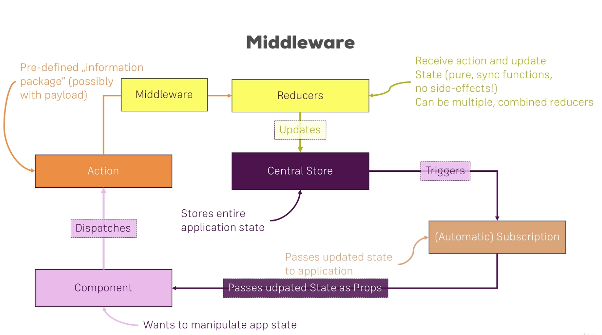

# Section16: Reduc Advanced

#### Adding Middleware

Middleware in general is a term used for functions or the code general you hook into a process which then gets executed as part of that process without stoping it.  
Middleware runs between a dispatch of an action & (just before) the reducer.
```javascript
// an example of middleware
const logger = store => {
    return next => {
        return action => {
            console.log('[Middleware] Dispatching', action);
            const result = next(action);
            console.log('[Middleware] next state', store.getState());
            return result;
        };
    };
};
```
Then we can apply this middleware to redux by using `applyMiddleware` provided by redux,  when we create store.  
`const store = createStore(rootReducer, applyMiddleware(logger));`

***
Redux DevTools(chrom extension): https://github.com/zalmoxisus/redux-devtools-extension  
using this DevTools can help us to look into srote more easily. Read more on this.

***
#### Executing Asynchronous Code
We can not use asynchronous code in the reduer, but with the help with `Action Creators` we can achieve the same behaviour.

##### Action creators
When we dispatch an action, we need to pass in an javascript object to the `dispatch` function. This time, we do not hardcode that object, instead, we will using function to create such an object.
`onIncrementCounter: () => dispatch({type:actionTypes.INCREMENT})`   
=>`onIncrementCounter: () => dispatch(increment())`  
`onAddCounter: () => dispatch({type:actionTypes.ADD, value:5})`  
=> `onAddCounter: () => dispatch(add({value:5}))`
```javascript
export const increment = () => {
    return {
        type: INCREMENT
    };
};
export const add = (payload) => {
    return {
        type: ADD,
        ...payload
    };
};
```
##### Handling asynchronous code
redux-thunk: https://github.com/reduxjs/redux-thunk  
`npm install --save redux-thunk`  
Action creator will not simply return an action objection anymore, it returns a function that will dispatch an action.  
Redux Thunk middleware allows you to write action creators that return a function instead of an action. The thunk can be used to delay the dispatch of an action, or to dispatch only if a certain condition is met. The inner function receives the store methods dispatch and getState as parameters.  
`import thunk from 'redux-thunk';` and added it to `applyMiddleware()`  
An action creator that returns a function to perform asynchronous dispatch:
```javascript
const INCREMENT_COUNTER = 'INCREMENT_COUNTER';

function increment() {
  return {
    type: INCREMENT_COUNTER,
  };
}

function incrementAsync() {
  return (dispatch) => {
    setTimeout(() => {
      // Yay! Can invoke sync or async actions with `dispatch`
      dispatch(increment());
    }, 1000);
  };
}
```
An action creator that returns a function to perform conditional dispatch:
```javascript
function incrementIfOdd() {
  return (dispatch, getState) => {
    const { counter } = getState();

    if (counter % 2 === 0) {
      return;
    }

    dispatch(increment());
  };
}
```
***
useful Links:
Middleware: https://redux.js.org/advanced/middleware/  
redux-thunk package: https://github.com/gaearon/redux-thunk  
Async Actions: https://redux.js.org/advanced/async-actions

