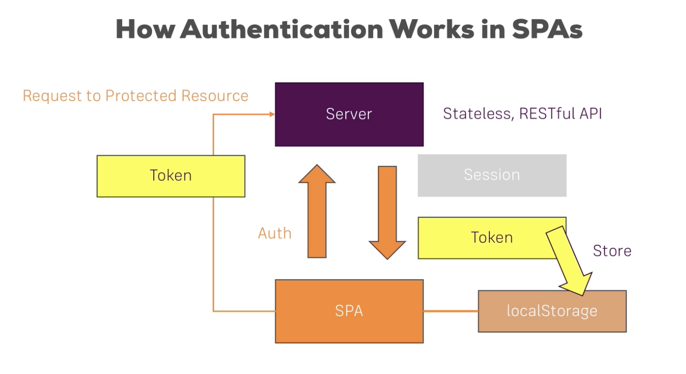

# Section18: Adding Authentication to Burger Project

### Authentication in React(in SPAs in General)


Some adjustments to our project:

- Add new view: sign-up and sign-in
- guards that protect some routes on the frontend
- passing the token to the backend for requests

***
we are using fairebase, to set authentication, we send request to

check more info on this page:https://firebase.google.com/docs/reference/rest/auth

*** 
storing the token  
currently we store on the global store, this will cause the user to lose the auth state on refresh the page.

#### Persistent Auth state with local storage  
`localStorage.setItem(key, value)` store an item in the local storage.  
`localStorage.removeItem(key)` remove the item with key  
`localStorage.getItem(key)` get the item with key

***
Accessing Protected Resources:
In firebase, we can setup read write rules.  
To allow authenticated user access protected resources, we nee to pass a query param `?auth={authToken}` when we post or get the request.

***
#### Guarding Routes:
In our project, unauthenticated user cant go to orders page, but if they type `.orders` in the url, they will still have access to that page eventhought nothing is there. We want to not showing this page at all.  
Simply add logic to the routes
```JSX
class App extends Component {

  componentDidMount() {
    this.props.onTryAutoSignup();
  };

  render() {

    let routes = (
      <Switch>
        <Route path='/auth' component={Auth} />
        <Route path='/' component={BurgerBuilder} />
        <Redirect to='/' />
      </Switch>
    );

    if (this.props.isAuthenticated) {
      routes = (
        <Switch>
          <Route path='/checkout' component={Checkout} />
          <Route path='/orders' component={Orders} />s
          <Route path='/logout' component={Logout} />
          <Route path='/' component={BurgerBuilder} />
        </Switch>
      );
    };

    return (
      <div>
        <Layout>
          {routes}
        </Layout>
      </div>
    );
  };
};

const mapStateToProps = state => {
  return {
    isAuthenticated: state.auth.token !== null
  };
};

const mapDispatchToProps = dispatch => {
  return {
    onTryAutoSignup: () => dispatch(actions.authCheckState())
  }
}

export default connect(mapStateToProps, mapDispatchToProps)(App);
```

***
##### Displaying user Specific orders:
In Firebase, we can filter data we fetch using query params.  
`const queryparams = '?auth=' + authToken + '&orderBy="userId"&equalTo= " ' + userId + '"';`  
read more about this on firebase.

*** 
useful Links:
SPA Authentication in general: https://stormpath.com/blog/token-auth-spa  
Firebase authentication REST API: https://firebase.google.com/docs/reference/rest/auth/ 