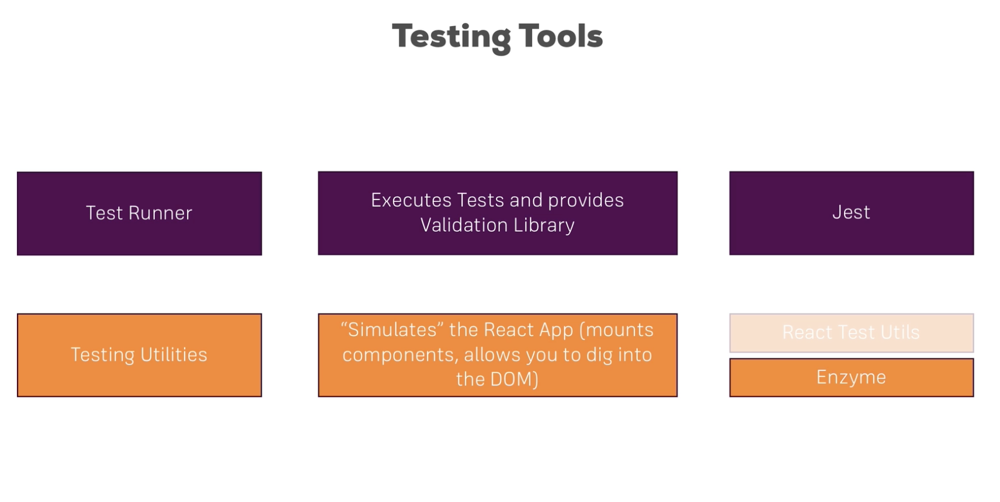

# Section20: Testing React Apps

### Testing Tools:
Jest: already installed in the app with creat-react-app  
Enzyme:  
`npm install --save enzyme react-test-renderer enzyme-adapter-react-16`


***
### Writing the first test

- file end with `.test.js` will automatically picked up by creat-react-app
- `describe()` takes in 2 arguments
    1. description of the test bundle this file holds(shows in console output)
    2. testing function: a normal js function inside we use `it()`
- `it()` takes in 2 arguments and allows to write one individual test
    1. description of what the test do
    2. testing function: a normal js function, we write our testing logic

run `npm test` to start the test
```JSX
import React from 'react';
import { configure, shallow } from 'enzyme';
import Adapter from 'enzyme-adapter-react-16';
import NavigationItems from './NavigationItems';
import NavigationItem from '../NavigationItem/NavigationItem';


configure({adapter: new Adapter()});

describe('<NavigationItems />', () => {

    let wrapper;

    beforeEach(()=>{
        wrapper = shallow(<NavigationItems />);
    })

    it('should render two <NavigationItem /> elements if not authenticated', () => {
        expect(wrapper.find(NavigationItem)).toHaveLength(2);
    });

    it('should render three <NavigationItem /> elements if authenticated', () => {
        wrapper.setProps({isAuthenticated: true});
        expect(wrapper.find(NavigationItem)).toHaveLength(3);
    });

    it('should render have <NavigationItem /> Logout elements if authenticated', () => {
        wrapper.setProps({isAuthenticated: true});
        expect(wrapper.contains(<NavigationItem link='/logout'>Logout</NavigationItem>)).toEqual(true);
    });
});
```

***
useful links  
Enzyme API: http://airbnb.io/enzyme/docs/api/  
Jest Docs: https://facebook.github.io/jest/