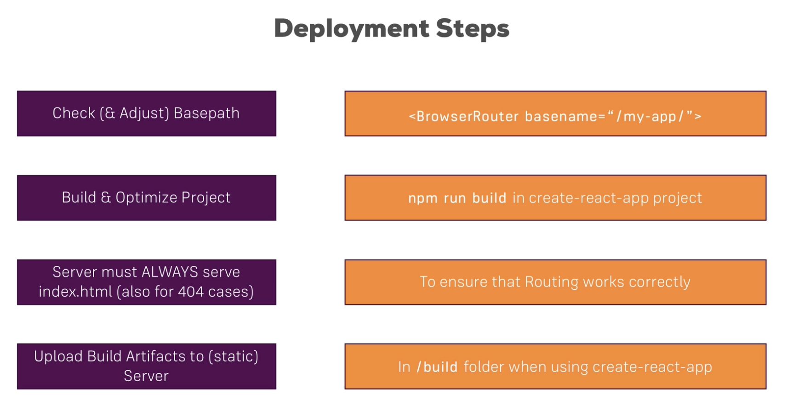
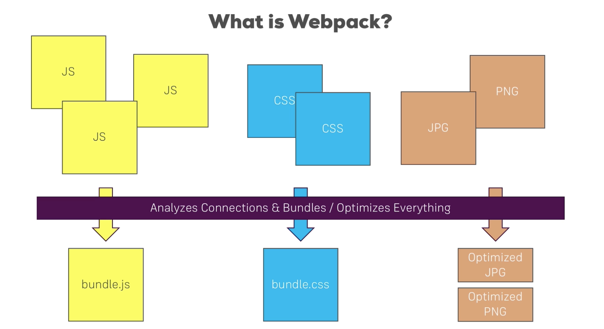
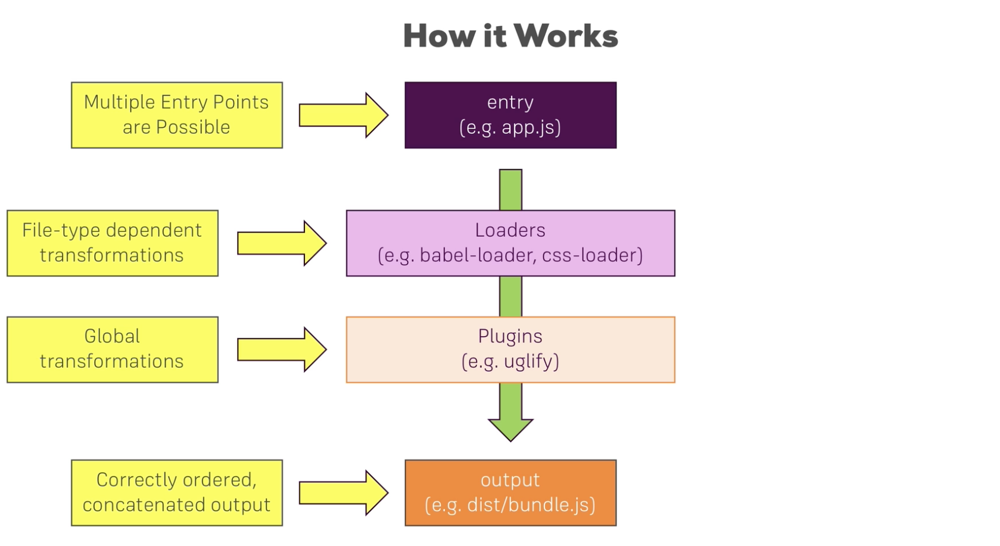
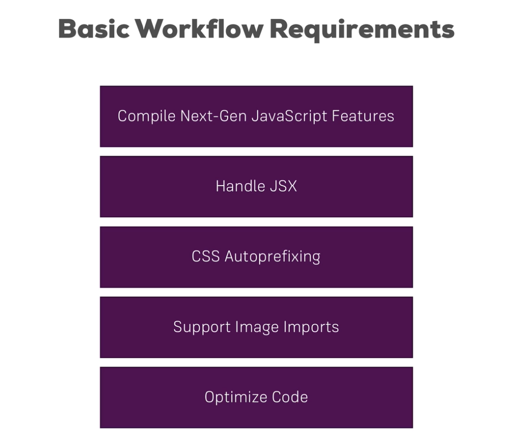

# Section21: Deploying the App to the Web

we will use firebase hosting: See documentation on firebase

***

# Section22: Webpack

Loaders are applied per file, Plugins are applied on the bundle.

***
